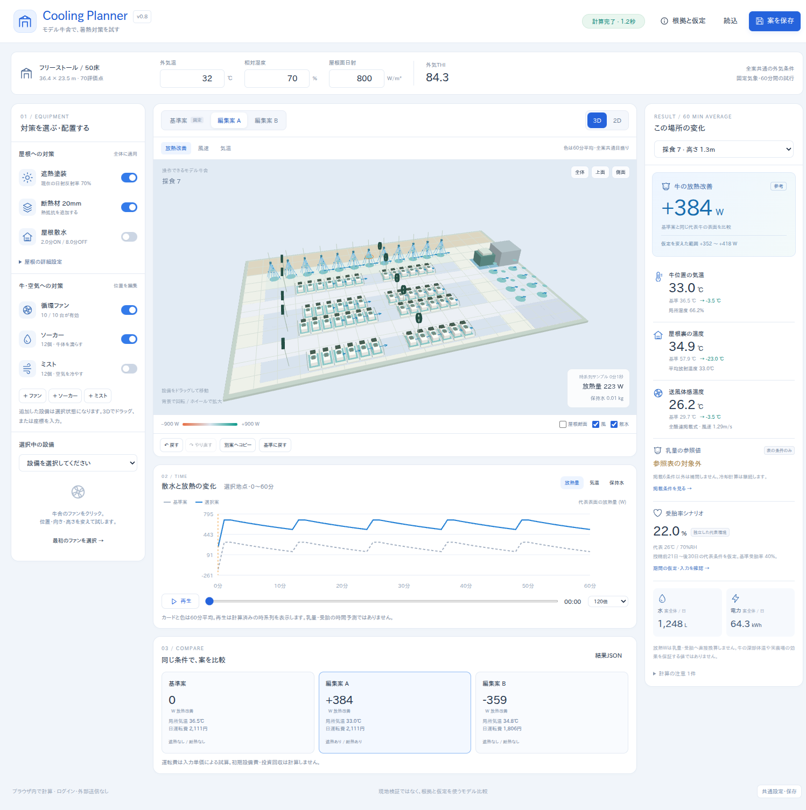

# Cooling Planner v0.8 — 実装の意図と結果

作成日：2026-09-26  
アプリ版：**0.8.0-preview.1**  
対象ソース：ユーザー提供 `dairy_cooling_simulator_v0_4_preview(1).zip`  
状態：**既存コードの再構成とモデル統合を実装。ローカルの計算・ブラウザ操作確認まで完了。公開環境の確認は未実施。**

## 1. 今回、何を作ったか

モデル牛舎の設備を変更し、屋根・空気・牛の放熱が変わる様子を、その場で比較するアプリに組み直した。

中心の操作は、**設備を選ぶ → 置く・動かす・設定する → 再計算 → 同じ地点の変化を見る → 比較案を保存する**。単に新しい数値カードを旧画面へ追加するのではなく、中央の操作空間と左の設備設定、右の結果、下の時間変化を一つの状態へ接続した。

生成した画面イメージではなく、実際にTypeScriptをビルドし、ブラウザ上で動かした成果物である。画面は簡略3Dを使用し、写実的な牛舎画像の再現を完成条件にはしなかった。



## 2. なぜ全面新規にしなかったか

採用したのは、事前に提案したC案「画面・統合処理は新しくするが、必要な計算と編集の仕組みは残す」。判断の理由は、旧版の画面構成が今の目的と違っても、ファンの座標、散水の到達、温湿度、水収支、Undo、保存の基礎は今も必要だからである。

### 再利用したもの

| 対象 | 今回の扱い |
|---|---|
| `model/geometry.ts` | 無変更。地点風速、噴霧、捕水、遮蔽、向き・高さの座標変換を再利用 |
| `model/physics.ts` | 無変更。湿り空気、対流・放射、体表水保持と蒸発を再利用 |
| `template/layout.ts` | 無変更。50床・70地点、区画と設備の相対位置を再利用 |
| `views/math3d.ts` | 無変更。投影・視点・ドラッグ位置計算を再利用 |
| `worker/protocol.ts` / `simulation.worker.ts` | 無変更。ジョブの送受信と古い結果の拒否を再利用 |
| `state/store.ts` | 屋根・参照設定・案のコピーを追加。1回のドラッグを1Undoとする編集処理を維持 |
| SVG / WebGLビュー | 描画と操作の基礎を再利用し、温度・放熱色、屋根断面、時間表示を拡張 |

新しい `src/` は24ファイル。その内訳は、元ファイルとSHA-256が一致するもの6、変更したもの12、新規6。これはファイル数の比較であり「コードの何%を再利用した」という比率ではない。ファイルごとの記録は `REUSE_MAP.json` にある。

既存の単体・数値・状態テスト38件は変更せず継承し、今回の統合後にも通過した。

## 3. 作り直した部分

### 3.1 画面

上部に全案共通の外気温・湿度・屋根面日射を配置。左に屋根対策、ファン・ソーカー・ミスト、選択設備の座標・高さ・向き・周期を配置した。中央の3D/2Dでは実際に設備を選択・移動できる。右は選択地点の結果、下は0〜60分の時系列と基準/A/B比較である。

屋根表示のON/OFFは**見た目だけ**。遮熱・断熱・屋根散水のスイッチとは別にした。屋根の前半を開いた断面表示で、内部の設備を見られる。

3Dでファンやノズルをドラッグすると位置が変わり、再計算される。背景をドラッグすると視点回転、ホイールは拡大縮小。2Dも設備操作に対応する。WebGLが利用できない場合はSVGの2Dへ切り替わる。

### 3.2 計算の接続

```text
共通気象 + 案ごとの屋根・設備
  ├─ 屋根の日射・断熱・水膜 → 屋根裏・舎内気温・放射温度
  ├─ 既存幾何 → 牛位置の風速・水の到達・ミスト配分
  └─ 3600秒の体表水と熱交換
       ├─ 地点ごとの60分平均・時系列・基準との差
       ├─ 掲載条件だけの乳量参照
       └─ 明示した期間代表条件での受胎参照
```

`roof.ts` はPython熱モデルv0.5から移植した。屋根側の計算は案ごとに一度行い、70地点が共通の屋根環境を参照する。各地点は独立した代表牛の試行で、70地点のWや蒸発量を牛群の総量へ加算しない。

既存のファン・噴霧幾何に接続するため、独立Python例の固定風速2m/s・捕水率0.25をアプリへそのまま埋め込んでいない。実際にその配置から求めた風速・捕水が入力になる。

同一の屋根や空気状態を計算キャッシュするが、近い温度へ丸める近似は行わない。屋根条件と参照モデル設定もハッシュに含め、旧結果が新しい設備条件の結果として表示されることを防いだ。

### 3.3 時間と結果の意味

時間計算は3600秒、基本1秒。初期保持水0で始める。画面へは第1秒と各60秒の計61点を返す。再生はこの計算済み時系列の表示であり、新しい日内気象・乳量・受胎の時間予測ではない。

カードと色は60分平均。再生中の小さな表示だけが選択時刻に近いサンプルを示す。表示用サンプルの選択や曲線の結線を、乳量の表の補間に使うことはない。

### 3.4 乳量・受胎

**乳量**は採用済みv0.6の6条件・RH60〜70%・静的条件をそのまま実装した。対象外はnull。平均値だけが表と一致しても、時間変動があれば適用しない。表を確認する補助画面では基準乳量を変更して参考kgを表示するが、現在の牛舎結果とは混同しない。

**受胎**はv0.7の5期間のTHI区分と全ORを保持した。初期は別の代表環境26℃・RH70%、仮の基準受胎率40%を用いる。60分平均を52日代表環境にするのはチェックを入れた場合だけで、仮定を保存する。送風・ソーカーのWをTHIへ上乗せしない。5期間別計算関数はあるが、初版UIは全期間共通の代表環境に限定した。

これらは元モデルの境界を変えずに実装したもの。すべての設備の効果が必ず乳量・受胎まで連続した数値になる、としていない。

### 3.5 保存・Undo・比較

保存はschemaVersion 8。屋根・日射・参照条件・モデル版・係数・案・表示設定を含む。読込後は再計算する。旧v4の自動変換はせず、旧形式・不正JSONは現在案を壊さず拒否する。

基準案は固定、編集案A/Bを操作する。コピーは屋根を含む全設備条件を複製する。位置変更で水や電力の使用量が勝手に増えないよう、配置依存の冷却計算と資源の算術を分けた。

## 4. 実際の統合計算結果

入力：外気32℃・RH70%・屋根面日射800W/㎡、36.4×23.5mのモデル牛舎。対象地点：**採食7、床上1.3m**。同じ初期ファン配置で、計算風速は約1.286m/s。全結果は今回のコードを実行した計算値であり、現場測定ではない。

| 項目 | 基準案 | 編集案A：遮熱＋断熱 |
|---|---:|---:|
| 設備 | 既存ファン＋ソーカー、屋根対策なし | 同じファン・ソーカー＋反射率0.7＋断熱20mm |
| 牛位置の気温 | 36.47℃ | 32.98℃ |
| 屋根裏温度 | 57.88℃ | 34.86℃ |
| その地点の風速 | 1.286m/s | 1.286m/s |
| 基準案からの放熱改善 | 0W | **+383.61W** |
| 仮定プロファイルを変えた差の範囲 | 0W | +351.77〜+417.55W |
| 日水使用量 | 1,248L | 1,248L |
| 日電力量 | 約64.3kWh | 約64.3kWh |
| 乳量 | 表の対象外 | 表の対象外 |
| 受胎の初期参考シナリオ | 22.0% | 22.0% |

受胎の22.0%は初期の独立した代表26℃・RH70%による値で、屋根設備の効果を判定した数値ではない。明示的な期間代表化をONにしても、この例は双方とも同じ高暑熱区分に入るため参照値は変わらない。

編集案Bは、同じファン＋ソーカー停止・ミスト稼働という初期設定。採食7の気温は34.83℃、基準案との差は−359.28W。基準案に既にソーカーがあること、場所と運転条件が異なることによる比較で、「ミストは一般に無効」という結論ではない。

乳量の別表参照では、27℃・2.24m/s・RH65%・基準35kgに対して、95% = 33.25kg/頭/日を返す。表にない条件は返さない。

当時の結果：`docs/evidence-v08/integrated-example-results.json`。読込用の同じ設定は `examples/02-roof-comparison.json`。元の独立例での放熱値と異なるのは、アプリでは固定2m/sではなく幾何からの風速・捕水を使うためである。

## 5. 今回実行した検証

| 層 | 結果 | 主な確認内容 |
|---|---:|---|
| TypeScript型チェック | 成功 | 新しい保存・入力・結果型の整合 |
| JavaScript/TypeScriptテスト | **62/62合格** | 旧38件＋新24件。屋根・乳量・受胎・保存・ハッシュ・全地点計算 |
| Python熱参照実装 | **17/17合格** | 今回再実行。元v0.5の回帰確認 |
| Python受胎参照実装 | **20/20合格** | 今回再実行。元v0.7の回帰確認 |
| Chromium操作テスト | **21/21合格** | 実ドラッグ、高さ・角度、Undo/Esc、JSON保存復元、比較、再生、390px幅、2Dフォールバック |
| 配布ビルド | 成功 | 単体HTMLと静的ファイル群 |

新規テストには、**Python熱モデルの8条件とTypeScript移植値の比較、および受胎の4計算例の一致**を含む。温度1e-6℃、熱量2e-5W等のテスト許容値で照合した。この値は移植一致のための数値許容誤差であり、現場予測の精度ではない。

ブラウザはLinux Chromium、Xvfb、SwiftShader。実際のCanvas選択・ドラッグ、WebGL、Blob Worker、ダウンロードとファイル読込を使用した。初回の21件実行では、テスト側のCSSセレクター記法の誤りで1件失敗し、修正後に**全件を再実行して21件合格**した。初回ログも残している。

今回の62件には旧38件を含む。Pythonの37件は参照実装の別試験であり、合計件数を独立した科学的検証の数とは扱わない。

### 検証記録

以下は独立版へ移した当時の記録。現在の検証結果は `docs/STANDALONE_VALIDATION.md` を参照する。

- `docs/evidence-v08/typecheck.log` / `unit-tests.log` / `build.log`
- `docs/evidence-v08/python-thermal.log` / `python-fertility.log`
- `docs/evidence-v08/browser-tests.log` / `browser-results.xml`
- `docs/evidence-v08/browser/test-runs/`：WebGLでの20操作ケースの実行状況。別の1ケースはWebGLを故意に使えなくしたSVGフォールバック試験。
- `docs/evidence-v08/verification-summary.json`：環境と集約結果。
- `docs/evidence-v08/browser/`：実際のデスクトップ・390px幅の画面。

## 6. 技術構成で意図的に変えたこと

モデルのPythonを呼ぶAPIサーバーは追加せず、TypeScriptに移してブラウザWorker内で計算する構成にした。静的配布で操作でき、モデルのコードと照合用Pythonを同じソースに残せるためである。

描画は今回、既存のnative WebGLに一本化した。前回の方針書にあった「標準環境でThree.jsへ整理する」という方向は、今回の動作版の必須条件にはしていない。未使用のThree.jsアダプターと旧Vite経路を新パッケージから除き、動作確認できる一つの配布構成にした。別レンダラーの導入だけで見た目が良くなったと装っていない。

完成を止めずに比較・操作を通すことを優先した選択であり、新しい物理モデルや調査項目を追加したものではない。

## 7. 確認できていないこと・残件

**アプリ統合の主経路は今回実装した。残るのは、主に配布先と実機での確認である。**

| 項目 | 状態 |
|---|---|
| 通常HTTPでのブラウザ遷移 | 制作環境で `net::ERR_BLOCKED_BY_ADMINISTRATOR`。配信の受入確認は未完了 |
| 公開HTTPS / AWS | 未公開・未確認。アカウント操作やデプロイは実施していない |
| 単体HTMLのfile://起動 | 自己完結形式として作成。今回のブラウザ確認はabout:blankへ同じHTMLを読み込む方法であり、file://の全環境での成功を主張しない |
| Windows/macOS/iOS/Android実機 | 未確認。390px幅試験はレスポンシブ表示であり、スマートフォン実機GPUの試験ではない |
| 最大40ファン・100ノズルの性能限界 | 入力上限は継承。最大構成の負荷試験は未実施 |
| 実牛舎との一致 | 初版の対象外。これを理由にモデル定義を再度未決に戻さない |

ブラウザの管理制限を回避する手段は使っていない。自己完結HTMLを通常のページ内容として試したことと、HTTP/公開配信の検証は分けて記録する。

生成画像のような写実性、24時間・季節予測、全対策から乳量・受胎への連続予測、初期設備費や投資回収、認証・課金は今回追加していない。いずれも、今回合意した範囲を未実装のまま隠したものではない。

## 8. 納品物と次の確認手順

`cooling-planner-v0.8.html` が単体の動作版、`dist-offline/` が静的配信版、`src/` が改修ソースである。詳細は同梱README。

まずPCで単体HTMLを開き、標準デモで「遮熱＋断熱 → ファン移動 → 再生 → 保存・読込」を試す。次に採用する静的ホスティングへ配信し、同じ経路を公開URLで確認する。今回のパッケージは、その確認に持ち出せる状態まで作成した。

モデルの追加調査ではなく、**実装した体験を実際に触って評価する段階**に進めている。

## 9. 参照仕様

- `reference/thermal/MODEL.md`：熱モデルv0.5の式・初期値・境界。
- `docs/cooling_planner_decisions_v0_6.md`：乳量、時間、対象外表示の確定事項。
- `reference/fertility/FERTILITY_MODEL_PROPOSAL.md`：受胎の採用根拠・係数・仮定と原論文URL。
- `docs/cooling_planner_source_review_2026-09-26.md`：今回の再構成方針の元になったソース評価。
- `docs/DECISIONS_v0_8.md`：今回の統合契約と旧資料の優先順位。

元資料は改変せず参照フォルダーに保存した。今回の移植・UI・検証の事実は、コードとevidenceを正本とする。
